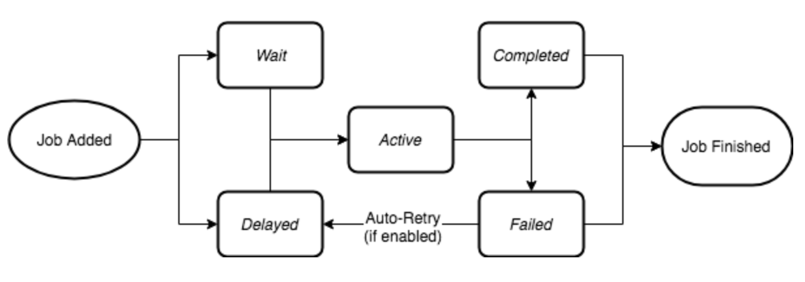
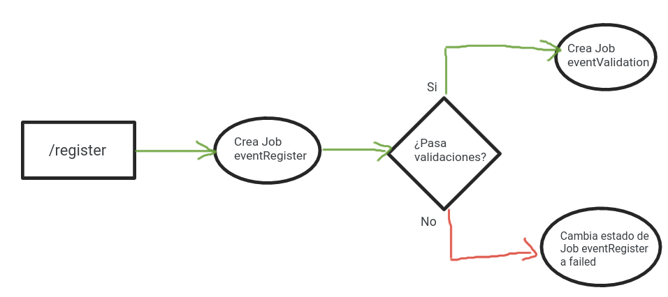

# Colas (queue - jobs) con NodeJS - Bull

## Ciclo de vida


## Flujo


## Prerequisitos

- Instalar [NodeJs](https://nodejs.org/en/download)
- Instalar [Redis](https://redis.io/docs/getting-started/installation/).
  -  Al ejecutar el comando ```redis-cli``` en la terminal, debe ingresar a redis por el port 6379, si no se cambia.
  -  Para eliminar todos las colas: ```flushall```
- Documentación [Bull](https://optimalbits.github.io/bull/)

## Pasos

1. Ejecutar en la raíz del proyecto, para descargar las dependencias
  ```sh
  npm install
  ```

2. Ejecutar el proyecto
  ```sh
  node index
  ```

3. Monitorear las queue con Arena http://localhost:3000/arena

4. Importar la [colección](collection-postman.json) de request en Postman para consumir los services de la api.

Autor
```
Ing. Pedag. Mg. Giovanny Gonzalez © 2023
```